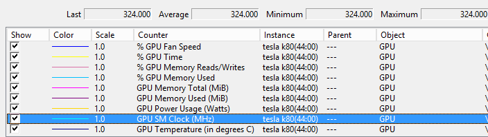
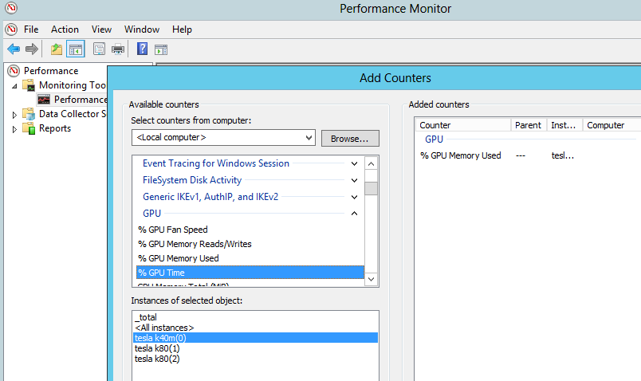
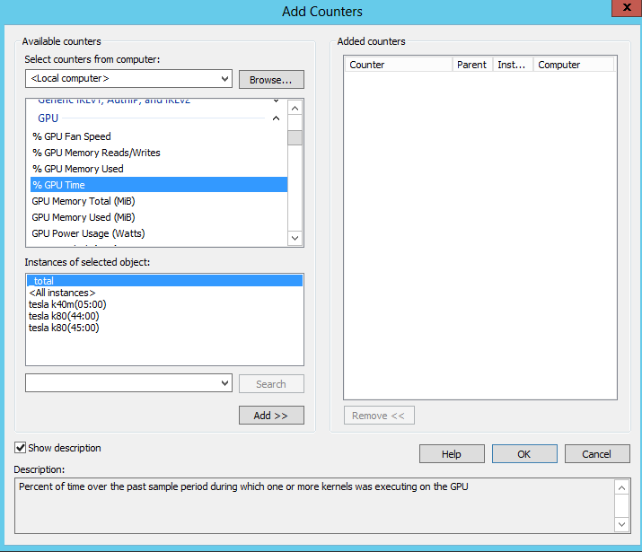
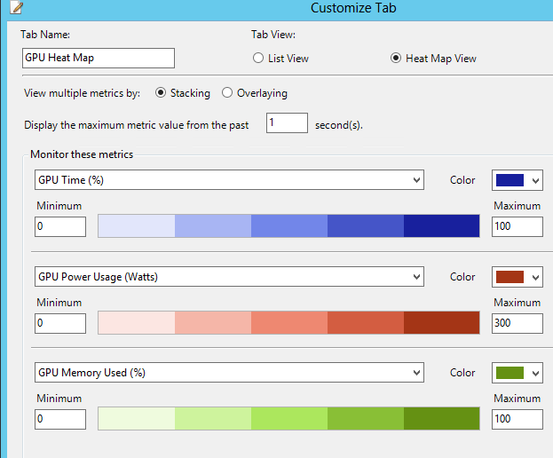
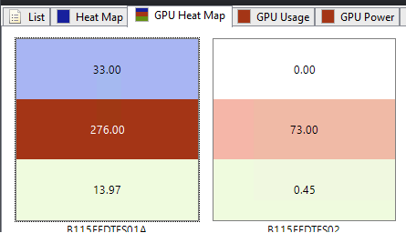

# Performance counters for NVIDIA GPUs
The goal of this project is to enable NVIDIA GPU performance counters both on a local machine via standard [perfmon](https://technet.microsoft.com/en-us/library/cc749249.aspx) tool and HPC Cluster.
The following counters are currently supported:



#### Requirements:
1. NVIDIA GPU. Both TCC and WDDM modes are supported.
2. Latest [drivers](http://www.nvidia.com/Download/index.aspx).

#### Install:
1. Download binary release or build it from the source code.
2. Install performance counters by running the following command from the binaries folder:
```
GpuPerfCounters.exe -install
```
3. Now that you have GPU performance counters service (`GpuPerfCounters`) installed, start it:
```
sc start GpuPerfCounters
```
4. To view GPU performance counters, run PerfMon (`perfmon.exe`) and add counters from `GPU` category:



#### Uninstall:
1. Stop `GpuPerfCounters` service:
```
sc stop GpuPerfCounters
```
2. Remove service from the registry:
```
GpuPerfCounters.exe -uninstall
```
3. It is now safe to delete binaries, if necessary.

## Enabling GPU counters in HPC Cluster

To enable counters in HPC cluster follow the steps below.

1. Install GpuPerfCounters service on every machine in the cluster.
Run the following commands (replace paths as needed):

```
rem Copy service executable to every node
clusrun xcopy /I /Y \\machine\d$\bin\GpuPerfCounters d:\bin\GpuPerfCounters
rem Install service
clusrun d:\bin\GpuPerfCounters\GpuPerfCounters.exe -install
rem Start service
clusrun sc start GpuPerfCounters
rem Restart HPC client monitoring service
clusrun sc stop HpcMonitoringClient
clusrun sc start HpcMonitoringClient
```

2. Verify that GPU performance counters are available in perfmon:



3. Open HPC Poweshell prompt and import HPC metrics from *GpuMetrics.xml* file.

```
Import-HPCMetric –path GpuMetrics.xml
```

Note that .xml file uses _total instance which is not recommended to use on machines with more than one GPU. Use specific instance names instead, for example:

```
Instance="tesla k80(44:00)"
```

Also note that in this case you will need to create separate metric for each instance with its own unique name. See *GpuMetrics.2Gpus.xml* file for more details.

Verify that metrics were imported successfully by running:

```
Get-HPCMetric
```

You should see the imported metrics in the list.

Verify that HPC services can read metric values by running the following PS command:

```
Get-HPCMetricValue -name GpuTime
```

4. Add metrics to HPC Cluster manager:
* Switch to Node Management.
* Add new tab, click Customize Tab button and select Heat Map View.
* In the new heat map view, click Customize Tab link in Actions pane.
* Select metrics from dropdown list. You can select up to 3 metrics, for example:



5. Now run some GPU jobs on the cluster and enjoy the view!


